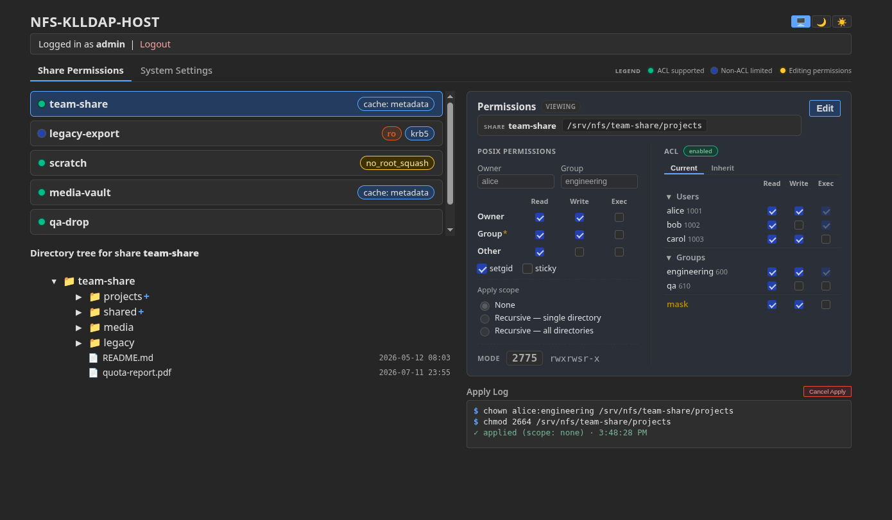
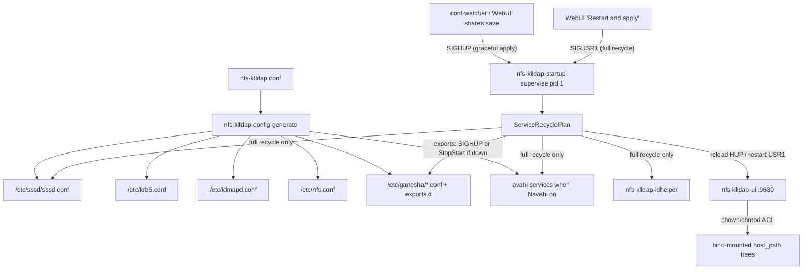
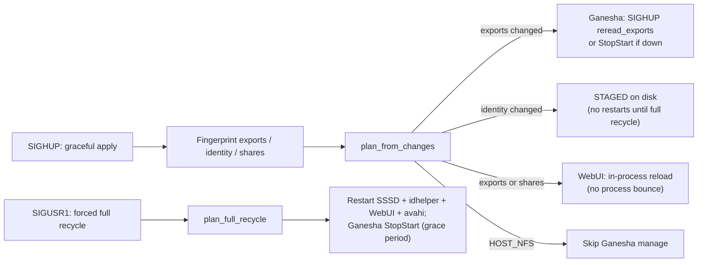
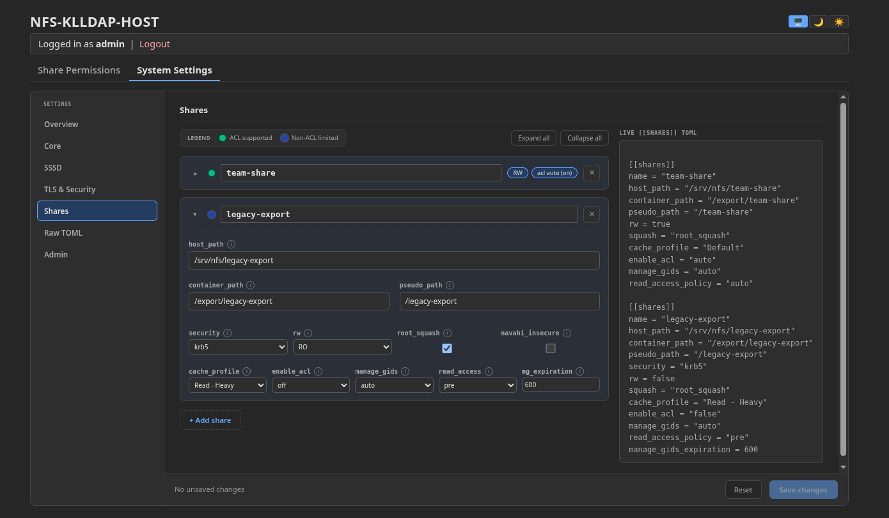

# nfs-klldap-host

<p>
  <a href="https://github.com/Aelieth/nfs-klldap-host/actions/workflows/gate.yml">
    
  </a>
  <a href="https://github.com/rust-secure-code/safety-dance/">
    
  </a>
  <a href="scripts/safety-dance.sh">
    
  </a>
  <a href="LICENSE">
    
  </a>
</p>

**1.0** — Kerberized NFSv4 host for [KLLDAP](https://github.com/Aelieth/lldap-with-kerberos). First-run setup at `https://<host>:9630/setup`; Overview shows the exact build stamp.

**nfs-klldap-host** is a companion for [KLLDAP](https://github.com/Aelieth/lldap-with-kerberos): it reads your directory, resolves users and groups into numeric UID/GID (and back to friendly names), and serves NFS shares with Kerberos-protected mounts and proper POSIX ownership. Opinionated defaults get shares on another host or device up quickly — one TOML file drives SSSD, Kerberos client config, idmap, and Ganesha exports — without hand-stitching five daemons and export fragments.

It stays flexible across real host setups: bind-mounted trees, mixed storage, and optional host-managed NFS (`HOST_NFS`). Per share it probes whether the serve path can do POSIX ACLs and falls back gracefully to NOACL with basic owner/group/mode when the filesystem cannot; capable mounts keep full ACL editing in the UI. A remote HTTPS WebUI lets domain admins and localhost operators browse trees, chown/chmod, stage ACL changes, and manage `[[shares]]` with a live TOML preview. Beyond a plain Ganesha container, you get identity materialization for user and machine principals (`nfs-klldap-idhelper`), SIGHUP-scoped export apply without bouncing sessions, SIGUSR1 full recycle for identity and main conf, optional Navahi mDNS click-mount for guest NFSv3 paths, and a custom Ganesha build tuned for KLLDAP group lookups.



## Documentation

| Doc | Purpose |
|-----|---------|
| [Running & deployment](docs/run/README.md) | Compose, env vars, TLS/proxy, HOST_NFS, keytab, troubleshooting |
| [Ganesha architecture & contracts](docs/ganesha-architecture.md) | `host_path` / `container_path` / `pseudo_path`, ACL vs NOACL, identity caches |
| [LDAP / SSSD / Kerberos](docs/ldap-integration.md) | SSSD generation, TLS, idhelper, verification |
| [Client: Fedora Immutable](docs/client-fedora-immutable.md) | Bazzite / Silverblue krb5p mount |
| [WebUI security model](nfs-klldap-ui/docs/security.md) | Root-in-container allow-list, symlink policy |
| [WebUI design notes](nfs-klldap-ui/docs/ui-design.md) | Tree, permissions panel, ACL tabs |
| [Testing](TESTING.md) | Coverage map and test patterns |
| [Container internals](container/README.md) | entrypoint, healthcheck, watcher, ganesha-ctl |
| [Custom Ganesha packaging](container/ganesha/README.md) | `9.13-1+klldap3` build flags |

Non-product: [`TODO.md`](TODO.md), [`nfs-klldap-host-ganesha-refactor-plan.md`](nfs-klldap-host-ganesha-refactor-plan.md).

## Architecture

One TOML (`nfs-klldap.conf`) drives generation of SSSD, Kerberos, idmapd, nfs.conf, Ganesha exports, and optional Navahi/Avahi service files. The WebUI (9630) edits the TOML and applies chown/chmod/ACL on allow-listed bind-mounted trees. Prefer `--uts=host` and a keytab with `nfs/<hostname>@REALM` principals matching the container hostname (short + FQDN). Runtime Ganesha is the custom **9.13-1+klldap3** package ([container/ganesha/](container/ganesha/)).



**Serve-path contract (summary):**

| Field | Role |
|-------|------|
| `host_path` | Host-visible absolute path; WebUI allow-list and ownership |
| `container_path` | **Required.** In-container serve dir = Ganesha `Path=` + probes + permission tree |
| `pseudo_path` | Client-visible NFSv4 Pseudo only (default `/<name>`) |

Full table and staging (`source_path`) → [docs/ganesha-architecture.md](docs/ganesha-architecture.md).

### Config reload / recycle

Two triggers, one pipeline. **SIGHUP** (conf-watcher, WebUI shares save, `ganesha-ctl reload`, or `docker kill -s HUP`) is the graceful shares-scoped apply: fingerprints drive `plan_from_changes` — Ganesha export reread when exports change, WebUI in-process reload, identity files **staged** on disk with **no** SSSD/idhelper/avahi bounce. WebUI sessions and NFS clients on unchanged shares stay up. **SIGUSR1** (WebUI **Restart and apply**, setup completion, `ganesha-ctl full-recycle`, or `docker kill -s USR1`) is the forced full recycle: every managed service restarts regardless of deltas — the only path that applies staged identity and settings fingerprints cannot see (ganesha main conf, nfs.conf, WebUI port/TLS/admin group, Navahi global toggle / avahi). WebUI logins survive process restart via the `webui-sessions` sidecar.



## Quick Start

**Recommended:** [examples/docker-compose.yml](examples/docker-compose.yml) with `network_mode: host` and `uts: host`.

```bash
docker compose -f examples/docker-compose.yml up -d
```

**Alternative** (`docker run` with host networking):

```bash
docker run -d \
  --name nfs-klldap \
  --network=host \
  --uts=host \
  --cap-add SYS_ADMIN --cap-add DAC_READ_SEARCH \
  -v /path/to/config:/config \
  -v /media/:/export \
  -v /secure/krb5.keytab:/etc/krb5.keytab:ro \
  -v /path/to/ganesha-recovery:/var/lib/nfs/ganesha \
  ghcr.io/aelieth/nfs-klldap-host:latest
```

Persist `/var/lib/nfs/ganesha` (compose: `ganesha-recovery`) so NFSv4 clients can reclaim locks/opens across container recreate.

First run writes the default `nfs-klldap.conf` template (never overwrites an existing file) and starts the WebUI. Open **https://\<host\>:9630/setup** for the 3-step wizard:

1. Persistent `/config` bind mount  
2. `ldap_uri` — **Test Settings**, then **Save and Continue**  
3. `[sssd]` bind DN + password — **Test Settings**, then **Save and Continue**  

Then **Restart and apply** (polls `/restart-status`) → `/login` for the localhost admin password.

**Pre-configured deploy:** mount a complete `nfs-klldap.conf` plus `/etc/krb5.keytab` — wizard skipped; go to `/login` (or main UI if `webui-password` exists).

Details: [docs/run/README.md](docs/run/README.md).

## Configuration

Single source of truth: `nfs-klldap.conf`. First run writes the heavily commented template from `nfs-klldap-config` (`generate_default_template`) to `/config/nfs-klldap.conf` (mode `0600`) and **never overwrites** it once present. The generator derives sssd.conf, krb5.conf, idmapd.conf, nfs.conf, and Ganesha fragments from this file; the WebUI rewrites `[[shares]]` blocks on every shares save.

Filled-in example matching the first-run template structure (values are illustrative):

```toml
# ldap_uri host MUST be a DNS name (not an IP). 6360 = LLDAP default LDAPS; 3890 unencrypted.
ldap_uri = "ldaps://klldap.example.com:6360"
navahi_discovery = false                                        # mDNS + NFSv3/AUTH_SYS click-mount for flagged shares; applies on "Restart & apply"

[storage]
container_root = "/export"                                      # Each share needs container_path under this root (Ganesha EXPORT Path=)

[management]
# webui_admin_group = "lldap_admin"                             # Default WebUI admin group

[server]
# hostname = "myhost.example.com"                               # Optional keytab/Navahi/cert override; prefer --uts=host

[sssd]
ldap_default_bind_dn = "uid=admin,ou=people,dc=example,dc=com"
ldap_default_authtok = "strong-secret"
# ldap_user_search_base = "ou=people,dc=example,dc=com"         # Optional; defaults to dc=<realm> (Subtree)
# ldap_group_search_base = "ou=people,dc=example,dc=com"
kllldap_ignored_attributes = true                               # KLLDAP: cuts attribute noise, faster lookups

# ldap_tls_reqcert = "never"                                    # auto-derived for internal/self-signed
# ldap_tls_cacert = "/path/to/ca.pem"                           # custom CA instead of never
# ldap_id_use_start_tls = true                                  # only with ldap:// + STARTTLS (not ldaps://)

[kerberos]
# realm = "EXAMPLE.COM"                                         # Auto-derived from ldap_uri host when unset

[ganesha]
default_security = "krb5p"                                      # krb5p | krb5i | krb5 (per-share security overrides)
# post_generate_hook = "/config/post-generate-staging-sync.sh"  # optional; after each generate (see examples/)

[webui]
# tls = false                                                   # TLS on by default; false or NFS_KLLDAP_WEBUI_TLS=off for reverse proxy
# tls_cert = "/config/webui.crt"
# tls_key = "/config/webui.key"
# session_timeout_minutes = 720                                 # WebUI auto-logout (default 720 = 12h, min 5); new logins after "Restart & apply"

# Shares — one [[shares]] block per export (optional on first run). WebUI rewrites these on save:
# [[shares]]
# name            = "users"                                     # Required - unique; default client mount path becomes /<name>
# host_path       = "/var/data/nvme-raid/users"                 # Required - host-side path (WebUI ownership + allow-list)
# container_path  = "/export/nvme-raid/users"                   # Required - in-container serve path under container_root
# pseudo_path     = "/users"                                    # Optional - client-visible NFSv4 name; defaults to /<name>
# rw              = true                                        # Optional - default true; false = read-only
# manage_gids     = true                                        # Optional - default true; full LDAP group lists server-side
# enable_acl      = false                                       # Optional - omit = auto (POSIX-ACL write probe); true hard-fails on non-ACL FS; false = NOACL
# source_path     = "/export/hdd-pool/users"                    # Optional - ACL staging source; post_generate_hook syncs → container_path
# navahi_insecure = false                                       # Optional - mDNS/NFSv3 guest advert; only while navahi_discovery = true
```

**Not in the first-run template** (schema still accepts them): `[probe]` `user_principal` / `client_host` for startup identity preflight (auto-picked when unset); advanced `[ganesha]` knobs such as `attr_expiration_secs`, `idmapped_validity_secs`, `warm_principals` — see [docs/ganesha-architecture.md](docs/ganesha-architecture.md).

Unrecognized share keys are ignored with warnings (`ganesha_path` gets a rename hint to `container_path`).

### Share options (generator)

| Option | Behavior |
|--------|----------|
| **Required** | `name`, `host_path`, and `container_path` under `container_root` |
| **ACL (`enable_acl`)** | `true` hard-fails generate on definitive non-ACL FS; `false` = NOACL; unset = **auto** (promote only when write probe proves storage). Same class on UI + `GET /client-manifest.json` |
| **NOACL emission** | `Disable_ACL = true; Manage_Gids = true; Read_Access_Check_Policy = pre;` (+ Pseudo). Explicit `manage_gids = false` honored |
| **ACL emission** | `Disable_ACL = false;` — no per-export Umask on 9.13 (Inherit tab + setgid) |
| **Limited FS** | Stage `source_path` → ACL-capable `container_path`; optional `[ganesha] post_generate_hook` (`examples/post-generate-staging-sync.sh`) |
| **Navahi** | Share `navahi_insecure` + top-level `navahi_discovery` → mDNS + NFSv3/AUTH_SYS. Global toggle needs Restart & apply (avahi + protocols) |

Diagnostics: `nfs-klldap-config fs-warnings` / `ganesha-ctl fs-warnings`.

### Cache profiles

**System Settings → Shares** stores a profile name; every generate rewrites `PrefRead` / `PrefWrite` from it.

| Profile | pref_read | pref_write | Best for |
|---------|-----------|------------|----------|
| Default | 1 MiB | 1 MiB | General / set-and-forget |
| Read - Basic | 4 MiB | 4 MiB | Light–moderate reads |
| Read - Heavy | 16 MiB | 8 MiB | Sequential media |
| Mixed Use | 4 MiB | 4 MiB | Everyday RW |
| Write - Heavy | 2 MiB | 16 MiB | Backups / uploads |

Legacy numeric `pref_read` / `pref_write` without `cache_profile` are still honored on generate. The WebUI maps known exact pairs to a profile name for the dropdown; unmatched pairs show **Default**. Host `read_ahead_kb` is outside the container.

### System Settings → Shares (WebUI)

Prefer the **System Settings → Shares** pane over hand-editing TOML: add/edit cards for `host_path` / `container_path` / `pseudo_path`, security, ACL class, cache profile, and Navahi, with a live `[[shares]]` preview. **Save changes** rewrites the conf and applies exports via SIGHUP; global toggles such as `navahi_discovery` need **Restart and apply**.



## Environment variables

Optional overrides (env always wins). Core: `NFS_KLLDAP_LDAP_URI`, bind DN/password, realm, hostname, storage root, Ganesha security, WebUI admin group, SSSD TLS fields, `[webui]` TLS. Full table: [docs/run/README.md](docs/run/README.md).

`HOST_NFS=true` (or `NFS_KLLDAP_HOST_NFS=true`) runs as a management sidecar: generate + WebUI + SSSD continue; container does **not** start `ganesha.nfsd`.

```yaml
environment:
  NFS_KLLDAP_LDAP_URI: ldaps://klldap.example.com:6360
  NFS_KLLDAP_SSSD_LDAP_DEFAULT_BIND_DN: uid=admin,ou=people,dc=example,dc=com
  NFS_KLLDAP_SSSD_LDAP_DEFAULT_AUTHTOK: "..."
  NFS_KLLDAP_KERBEROS_REALM: EXAMPLE.COM
  NFS_KLLDAP_WEBUI_TLS: "off"
```

## WebUI (9630)

| Path | Role |
|------|------|
| `/setup/1`…`/setup/3` | First-run wizard + Test Log |
| `/login` | localhost password or LLDAP admin |
| `/` | FS browser + chown/chmod + ACL panel (hero screenshot above) |
| `/settings` | Overview (build stamp, FS reprobe, WebUI LDAP client reload/clear), Core/SSSD/TLS, shares, raw TOML, Admin (restart, password, session TTL) |
| `/client-manifest.json` | Public share class list (no session) |

Auth: localhost sidecar `webui-password` (iterated SHA-256, 0600) or members of `webui_admin_group` (default `lldap_admin`). Sessions persist across WebUI restarts via `webui-sessions`.

**Shares editor:** see [System Settings → Shares](#system-settings--shares-webui) under Configuration. Ganesha/idhelper group flush remains CLI: `ganesha-ctl refresh-identity [user]`.

**Permission apply (short):** root-in-container via `FsManager` + `privileged`; no symlink descent; directory modes fuse r→x; recursive scopes send explicit file bits; numeric UID/GID only on disk. Full model: [nfs-klldap-ui/docs/security.md](nfs-klldap-ui/docs/security.md).

## Identity & Kerberos (idhelper)

`nfs-klldap-idhelper` classifies machine vs user principals and materializes nss_wrapper + extrausers (full supplemental groups) for Ganesha `UseGetpwnam` / `getgrouplist`.

```bash
nfs-klldap-idhelper resolve 'alice@REALM' --json
nfs-klldap-idhelper classify 'host/myfedora@REALM'
ganesha-ctl id-resolve 'user@REALM'
ganesha-ctl id-check
```

- Forms: `user@REALM`, `host/hostname@REALM` (also `nfs/` / `root/` prefixes). Machines map to uid/gid **0** for NSS; they are **not** Kerberos export-root — generated `Root_Kerberos_Principal` is `nfs, root` (no `host`), with default `root_squash`.
- Ganesha: `Only_Numeric_Owners` + `Allow_Numeric_Owners`; DIRECTORY_SERVICES nsswitch.
- Periodic rebulk: `NFS_KLLDAP_IDHELPER_REBULK_INTERVAL_SECS` (default **180**, `0` = off). Observer covers new principals from logs.
- Group-change flush: `ganesha-ctl refresh-identity [user]` (SSSD + idhelper rebulk + Ganesha `purge_gids`; nonzero exit if a layer fails).

Deep dive: [docs/ldap-integration.md](docs/ldap-integration.md).

## Prerequisites

- Kerberos time sync  
- `--uts=host` so hostname matches `/proc/sys/kernel/hostname`  
- Keytab (0600) with `nfs/<short>@REALM` and `nfs/<fqdn>@REALM` when they differ (short UTS → FQDN `{short}.{realm_lower}`)  
- DNS hostname in `ldap_uri` (no raw IP); forward + reverse for the NFS principal  
- Bind-mounted data with numeric uid/gid matching KLLDAP POSIX attributes  

## Project layout

| Path | Role |
|------|------|
| `nfs-klldap-identity/` | Shared LDAP / Kerberos / NSS primitives |
| `nfs-klldap-config/` | validate + generate + `nfs-klldap-startup` + `nfs-klldap-idhelper` |
| `nfs-klldap-ui/` | Axum WebUI |
| `entrypoint.sh` | exec → `nfs-klldap-startup supervise` |
| `container/` | healthcheck, conf-watcher, ganesha-ctl |

## Development & testing

```bash
make test          # cargo test --workspace
make clippy        # nightly clippy -D warnings
make gate          # safety-dance (clippy + no unsafe/libc) + comment lint + version pins + tests
```

All first-party crates use `#![deny(unsafe_code, dead_code)]`. `scripts/safety-dance.sh` re-checks that policy (same spirit as [safety-dance](https://github.com/rust-secure-code/safety-dance/)). See [TESTING.md](TESTING.md).

## License

MIT — see LICENSE.
