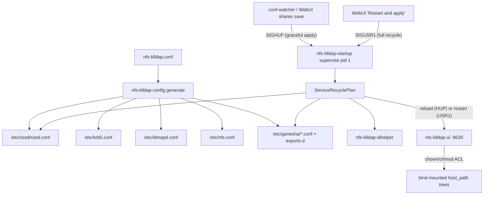
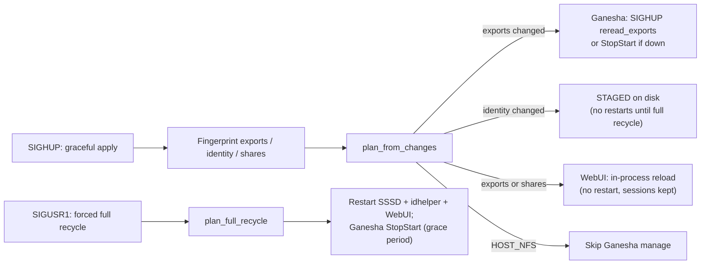

# nfs-klldap-host

**1.0** — WebUI setup wizard at `/setup` (HTTPS :9630); first-run configuration is browser-based (since 0.9.x). Versions follow git branches; the Overview page shows the exact build stamp.

Companion app for [KLLDAP](https://github.com/Aelieth/lldap-with-kerberos). Docker container that hosts and manages NFS shares with POSIX attributes synced via LDAP, plus simple remote management against KLLDAP.

Debian 13-slim runtime (Rust build stages on Fedora minimal): Kerberized NFSv4 (NFS-Ganesha) with KLLDAP-backed UID/GID mapping via SSSD. Multi-stage build keeps cargo-chef reliable on Fedora; final image uses Debian 13-slim with a custom Ganesha package from this repo (`container/ganesha/`). Optional **Navahi network discovery** advertises flagged shares over mDNS/Avahi for click-mount from GNOME/KDE file managers (an insecure NFSv3/AUTH_SYS guest path — see [Running & deployment](docs/run/README.md)).


## Documentation

| Doc | Purpose |
|-----|---------|
| [Running & deployment](docs/run/README.md) | Compose, env vars, TLS/proxy, HOST_NFS, keytab, troubleshooting |
| [Ganesha architecture & contracts](docs/ganesha-architecture.md) | `host_path` / `container_path` / `pseudo_path`, ACL vs NOACL, identity caches |
| [LDAP / SSSD / Kerberos](docs/ldap-integration.md) | SSSD generation, TLS, idhelper, verification |
| [Client: Fedora Immutable](docs/client-fedora-immutable.md) | Bazzite / Silverblue krb5p mount |
| [WebUI security model](nfs-klldap-ui/docs/security.md) | Root-in-container allow-list, symlink policy |
| [WebUI design notes](nfs-klldap-ui/docs/ui-design.md) | Tree, permissions panel, ACL tabs |
| [Testing](TESTING.md) | Coverage map and test patterns |
| [Container internals](container/README.md) | entrypoint, healthcheck, watcher, ganesha-ctl |
| [Custom Ganesha packaging](container/ganesha/README.md) | `9.13-1+klldap3` build flags |

Historical / non-product: [`TODO.md`](TODO.md), [`nfs-klldap-host-ganesha-refactor-plan.md`](nfs-klldap-host-ganesha-refactor-plan.md) (not shipped behavior).

## Architecture

One TOML (`nfs-klldap.conf`) drives generation of SSSD, Kerberos, idmapd, nfs.conf, and Ganesha exports. The WebUI (9630) edits the TOML and applies direct chown/chmod on bind-mounted trees. Prefer `--uts=host` and a keytab with `nfs/<hostname>@REALM` principals matching the container hostname (short + FQDN).



**Serve-path contract (summary):**

| Field | Role |
|-------|------|
| `host_path` | Host-visible absolute path; WebUI allow-list and ownership |
| `container_path` | **Required.** In-container serve dir = Ganesha `Path=` + probes + permission tree |
| `pseudo_path` | Client-visible NFSv4 Pseudo only (default `/<name>`) |

Full table and staging (`source_path`) → [docs/ganesha-architecture.md](docs/ganesha-architecture.md).

### Config reload / recycle

Two triggers, one pipeline. **SIGHUP** (the conf-watcher, a WebUI shares save, `ganesha-ctl reload`) is the graceful shares-scoped apply: nothing user-facing restarts, so WebUI sessions/connections and NFS clients on unchanged shares are untouched. **SIGUSR1** (the WebUI "Restart and apply" button, setup completion, `ganesha-ctl full-recycle`) is the forced full recycle: every managed service restarts regardless of what changed — the only path that applies staged identity changes and edits the fingerprints cannot see (ganesha main conf, nfs.conf, WebUI port/TLS/admin group).



## Quick Start

**Recommended:** [examples/docker-compose.yml](examples/docker-compose.yml) with `network_mode: host` and `uts: host`.

```bash
docker compose -f examples/docker-compose.yml up -d
```

**Alternative** (`docker run` with host networking):

```bash
docker run -d \
  --name nfs-klldap \
  --network=host \
  --uts=host \
  --cap-add SYS_ADMIN --cap-add DAC_READ_SEARCH \
  -v /path/to/config:/config \
  -v /media/:/export \
  -v /secure/krb5.keytab:/etc/krb5.keytab:ro \
  ghcr.io/aelieth/nfs-klldap-host:latest
```

First run writes a default `nfs-klldap.conf` and starts the WebUI. Open **https://\<host\>:9630/setup** for the 3-step wizard:

1. Persistent `/config` bind mount  
2. `ldap_uri` — **Test Settings**, then **Save and Continue**  
3. `[sssd]` bind DN + password — **Test Settings**, then **Save and Continue**  

Then **Restart and apply** (polls `/restart-status`) → `/login` for the localhost admin password.

**Pre-configured deploy:** mount a complete `nfs-klldap.conf` plus `/etc/krb5.keytab` — wizard skipped; go to `/login` (or main UI if `webui-password` exists).

Details: [docs/run/README.md](docs/run/README.md).

## Configuration

Sample `nfs-klldap.conf`:

```toml
ldap_uri = "ldaps://klldap.example.com:6360"                     # LLDAP default secure port; 3890 unencrypted

[storage]
container_root = "/export"                                      # Anchor for Ganesha + UI path translation
# Each share requires container_path under container_root (no auto-derivation from host_path).
# pseudo_path ("Pseudo Path" in the Shares editor) is only the client-visible NFSv4 name.

[management]
# webui_admin_group = "lldap_admin"

[server]
# hostname = "myhost.example.com"                               # Optional keytab override; prefer --uts=host

[sssd]
ldap_default_bind_dn = "uid=admin,ou=people,dc=example,dc=com"
ldap_default_authtok = "strong-secret"
# ldap_user_search_base = "ou=people,dc=example,dc=com"         # Optional; default dc=<realm> Subtree
# ldap_group_search_base = "ou=people,dc=example,dc=com"
kllldap_ignored_attributes = true                               # Default; cuts KLLDAP attribute noise

[kerberos]
# realm = "EXAMPLE.COM"                                         # Auto-derived from ldap_uri host when unset

[probe]
# user_principal = "someuser"                                   # Optional identity preflight; auto-picked if unset
# client_host = "laptop-1"                                      # host/<name>@REALM; auto-picked if unset

[ganesha]
default_security = "krb5p"                                      # krb5p | krb5i | krb5

[webui]
# tls = false                                                   # TLS on by default; false or NFS_KLLDAP_WEBUI_TLS=off for reverse proxy
# tls_cert = "/config/webui.crt"
# tls_key = "/config/webui.key"
# session_timeout_minutes = 720                                 # WebUI auto-logout (default 720 = 12h, min 5); new logins after "Restart & apply"

# [[shares]]
# name            = "movies"                                    # Required - unique share name; default client mount path becomes /<name>
# host_path       = "/home/user/nfs-data/movies"                # Required - host-side data path (WebUI ownership + allow-list checks)
# container_path  = "/export/movies"                            # Required - in-container serve path under container_root (Ganesha EXPORT Path)
# pseudo_path     = "/movies"                                   # Optional - client-visible mount path; defaults to /<name>
# rw              = true                                        # Optional - default true; false exports read-only
# manage_gids     = true                                        # Optional - default true; resolves full LDAP group lists server-side
# enable_acl      = false                                       # Optional - omit = auto (the POSIX-ACL write probe decides); true hard-fails generate on a non-ACL filesystem; false forces NOACL
# source_path     = "/export/staging/movies"                    # Optional - ACL staging source; post_generate_hook syncs it into the ACL-capable container_path
# navahi_insecure = false                                       # Optional - advertise via mDNS for NFSv3/AUTH_SYS click-mount; needs top-level navahi_discovery = true
```

`[[shares]]` is optional on first run. The generator writes sssd.conf, krb5.conf, idmapd.conf, nfs.conf, and Ganesha fragments. Unrecognized share keys are ignored with warnings (`ganesha_path` gets a rename hint to `container_path`).

### Share options (generator)

- **Required:** `container_path` under `container_root`.
- **ACL class (per share):** `enable_acl` tri-state — `true` hard-fails generate if the serve path is definitively non-ACL; `false` = NOACL; unset = **auto** (promote only when the write round-trip probe proves storage). Same class on Share Permissions, System Settings, and `GET /client-manifest.json`.
- **NOACL emission:** `Disable_ACL = true; Manage_Gids = true; Read_Access_Check_Policy = pre;` (plus Pseudo). Explicit `manage_gids = false` still honored.
- **ACL emission:** `Disable_ACL = false;` (declared). No per-export FSAL `Umask` on Ganesha 9.13 — creation modes use default ACL Inherit tab + setgid.
- **Limited / non-ACL-capable FS (vfat, ntfs, btrfs+noacl):** cannot store POSIX ACLs; on 9.13 attribute fetches may fail for both classes — stage via `source_path` → ACL-capable `container_path` and optional `[ganesha] post_generate_hook` (see `examples/post-generate-staging-sync.sh`).
- **Diagnostics:** `nfs-klldap-config fs-warnings` / `ganesha-ctl fs-warnings`.
- **Navahi discovery (per share):** `navahi_insecure = true` together with the top-level `navahi_discovery` toggle advertises the share over mDNS and widens its export to NFSv3 + AUTH_SYS for GNOME/KDE click-mount. The toggle applies on "Restart & apply"; details in [docs/run/README.md](docs/run/README.md).

### Cache profiles

**System Settings → Shares** stores a profile name; every generate rewrites `PrefRead` / `PrefWrite` from it.

| Profile | pref_read | pref_write | Best for |
|---------|-----------|------------|----------|
| Default | 1 MiB | 1 MiB | General / set-and-forget |
| Read - Basic | 4 MiB | 4 MiB | Light–moderate reads |
| Read - Heavy | 16 MiB | 8 MiB | Sequential media |
| Mixed Use | 4 MiB | 4 MiB | Everyday RW |
| Write - Heavy | 2 MiB | 16 MiB | Backups / uploads |

Legacy numeric `pref_read` / `pref_write` without `cache_profile` are still honored. Structured WebUI save maps numerics to the nearest profile. Host `read_ahead_kb` is outside the container.

## Environment variables

Optional overrides (env always wins). Core: `NFS_KLLDAP_LDAP_URI`, bind DN/password, realm, hostname, storage root, Ganesha security, WebUI admin group, SSSD TLS fields, `[webui]` TLS. Full table: [docs/run/README.md](docs/run/README.md).

`HOST_NFS=true` (or `NFS_KLLDAP_HOST_NFS=true`) runs as a management sidecar: generate + WebUI + SSSD continue; container does **not** start `ganesha.nfsd`.

```yaml
environment:
  NFS_KLLDAP_LDAP_URI: ldaps://klldap.example.com:6360
  NFS_KLLDAP_SSSD_LDAP_DEFAULT_BIND_DN: uid=admin,ou=people,dc=example,dc=com
  NFS_KLLDAP_SSSD_LDAP_DEFAULT_AUTHTOK: "..."
  NFS_KLLDAP_KERBEROS_REALM: EXAMPLE.COM
  NFS_KLLDAP_WEBUI_TLS: "off"
```

## WebUI (9630)

| Path | Role |
|------|------|
| `/setup/1`…`/setup/3` | First-run wizard + Test Log |
| `/login` | localhost password or LLDAP admin |
| `/` | FS browser + chown/chmod + ACL panel |
| `/settings` | TOML editor, shares, restart/apply, identity cache tools |
| `/client-manifest.json` | Public share class list (no session) |

Auth: localhost sidecar `webui-password` (SHA-256) or members of `webui_admin_group` (default `lldap_admin`).

**Permission apply (short):** root-in-container via `FsManager` + `privileged`; no symlink descent; directory modes fuse r→x; recursive scopes send explicit file bits; numeric UID/GID only on disk. Full model: [nfs-klldap-ui/docs/security.md](nfs-klldap-ui/docs/security.md).

## Identity & Kerberos (idhelper)

`nfs-klldap-idhelper` classifies machine vs user principals and materializes nss_wrapper + extrausers (complete supplemental groups, including uid 0 for machines) for Ganesha `UseGetpwnam` / `getgrouplist`.

```bash
nfs-klldap-idhelper resolve 'alice@REALM' --json
nfs-klldap-idhelper classify 'host/myfedora@REALM'
ganesha-ctl id-resolve 'user@REALM'
ganesha-ctl id-check
```

- Supported forms: `user@REALM`, `host/hostname@REALM` (machines → uid/gid 0).
- Ganesha: `Only_Numeric_Owners` + `Allow_Numeric_Owners`; DIRECTORY_SERVICES nsswitch.
- Periodic rebulk: `NFS_KLLDAP_IDHELPER_REBULK_INTERVAL_SECS` (default **180**, `0` = off). Observer covers new principals from logs.
- Group-change flush: `ganesha-ctl refresh-identity [user]` (SSSD + idhelper rebulk + Ganesha purge_gids).

Deep dive: [docs/ldap-integration.md](docs/ldap-integration.md).

## Prerequisites

- Kerberos time sync  
- `--uts=host` so hostname matches `/proc/sys/kernel/hostname`  
- Keytab (0600) with `nfs/<short>@REALM` and `nfs/<fqdn>@REALM` when they differ  
- DNS hostname in `ldap_uri` (no raw IP); forward + reverse for the NFS principal  
- Bind-mounted data with numeric uid/gid matching KLLDAP POSIX attributes  

## Project layout

| Path | Role |
|------|------|
| `nfs-klldap-identity/` | Shared LDAP / Kerberos / NSS primitives |
| `nfs-klldap-config/` | validate + generate + `nfs-klldap-startup` + `nfs-klldap-idhelper` |
| `nfs-klldap-ui/` | Axum WebUI |
| `entrypoint.sh` | exec → `nfs-klldap-startup supervise` |
| `container/` | healthcheck, conf-watcher, ganesha-ctl |

## Development & testing

```bash
make test
# or: cargo test --workspace
```

See [TESTING.md](TESTING.md).

## License

MIT — see LICENSE.
