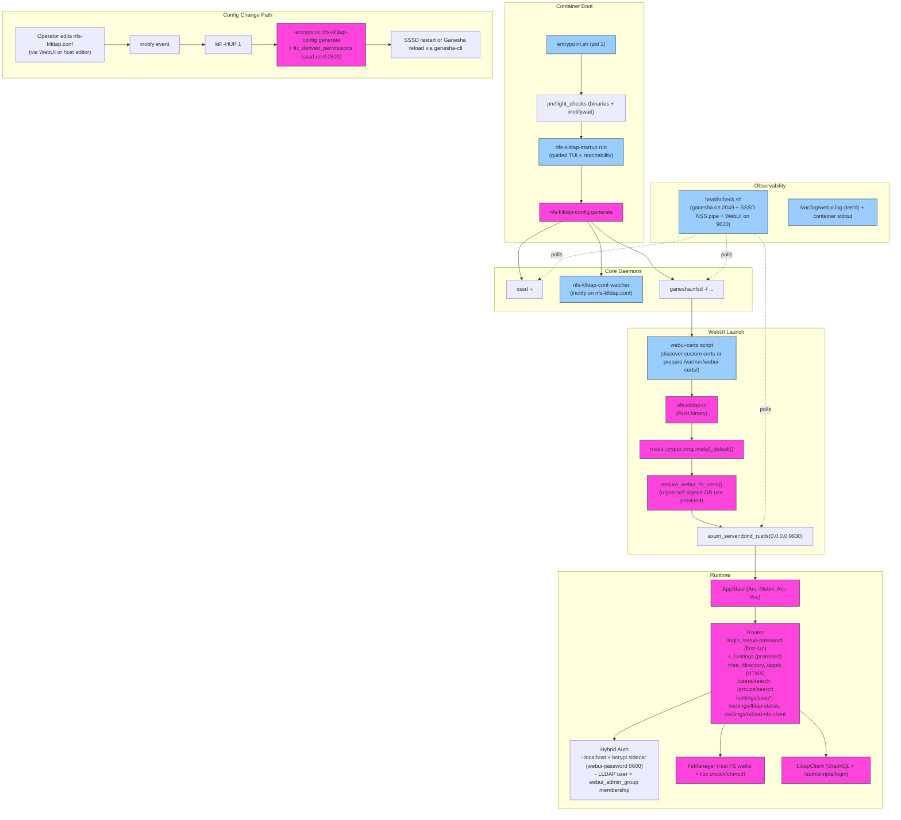

# nfs-klldap-host

**AlmaLinux 10 container that provides a complete Kerberized NFSv4 server using NFS-Ganesha, backed by KLLDAP for POSIX UID/GID attributes.**

Designed for hosts that cannot (or do not want to) run the kernel NFS stack.

---

## Core Idea

Plug this container into any Linux host (even one without kernel NFS modules) and it becomes a fully functional, authoritative Kerberized NFSv4 server.

**The architecture** uses a single source of truth:

- One `nfs-klldap.conf` (TOML) file
- A small, type-safe Rust binary (`nfs-klldap-config`) bundled in the container that auto-derives and generates everything else
- WebUI that runs **inside** the container on port 9630 (HTTPS, self-signed or user-provided certs) and edits the shared config volume directly
- WebUI performs chown/chmod **directly** on bind-mounted paths (no docker-exec, no host helper)

This gives you **maximum simplicity with full power** — minimal volumes, no templates, no DBUS, no kernel NFS on the host, and automatic reloads when you change the config.

---

## Goals

- Deliver a complete Kerberized NFSv4 service from inside a container with almost zero host configuration
- Use KLLDAP (LLDAP + Kerberos in one) as the single source of truth for both POSIX attributes and Kerberos
- Make share and permission management visual and trivial through the in-container WebUI
- Support per-share security settings (`krb5p` / `krb5i`) and complex multi-share environments
- Run all services as root inside the container (matching Red Hat expectations for sssd/kerberos). The WebUI (also root) performs direct chown/chmod on bind-mounted data using libc.
- Enable future one-command deployment from a KLLDAP server

---

## How It Works (The Core Model)

This system is built around **one simple idea**:

> A single TOML file (`nfs-klldap.conf`) is the only thing you edit.  
> Everything else — SSSD config, Kerberos config, Ganesha exports, and permission management — is automatically derived and kept in sync.

### Why This Design?

- **Simplicity**: No templates, no multiple config files, no manual sssd.conf editing.
- **Safety**: The container runs as root (standard for the appliance). Permission changes (`chown`/`chmod`) are performed directly by the in-container WebUI on the bind-mounted paths.
- **Correctness**: `host_path` (real location on your host) is separated from the container path Ganesha actually serves. This allows the web UI to manage real host permissions while Ganesha only sees bind-mounted paths.
- **Flexibility**: You control bind mounts. The config just tells the system *where* the data lives on the host.

### The Flow (Step by Step)

1. **You edit** `nfs-klldap.conf` (via the web UI or by hand)
2. **Rust binary** (`nfs-klldap-config`) detects the change and regenerates:
   - `/etc/sssd/sssd.conf`
   - `/etc/krb5.conf`
   - Ganesha export fragments
3. **Ganesha + SSSD** automatically reload
4. **Web UI** (inside the container on 9630) performs `chown`/`chmod` directly on the bind-mounted `host_path` directories (root inside the container)

### Key Concepts

| Concept          | What It Is                                                                 | Who Uses It                  |
|------------------|----------------------------------------------------------------------------|------------------------------|
| `host_path`      | Real absolute path on your Docker **host**                                 | Web UI + permission helper   |
| Bind mount (`-v`)| Makes host data visible inside the container at `/export/{name}`           | You (when starting container)|
| `export_path`    | Path NFS clients see (defaults to `/<name>`)                               | NFS clients + Ganesha        |
| `container_root` | Base inside container (default `/export`)                                  | Ganesha only                 |

This design keeps powerful management capabilities while the container remains a self-contained appliance.

---

## Building

The project uses a standard Rust Cargo workspace. The two crates live at the top level:

```bash
# Clone
git clone https://github.com/aelieth/nfs-klldap-host.git
cd nfs-klldap-host

# Build both crates (recommended for development)
cargo build --workspace

# Or build the full container image
docker build -t nfs-klldap-host .
```

### Using the Makefile (convenience targets)

The `Makefile` wraps the above for common tasks:

```bash
make build                 # Native release build of the UI binary
make dist                  # Cross-compile amd64 + arm64 binaries
make docker                # Local container image
make docker-multi          # Multi-arch image via buildx
make test
make clippy
```

Run `make help` for the full list.

See [TESTING.md](TESTING.md) for testing instructions.

## Testing & Documentation

See [TESTING.md](TESTING.md) for the current testing strategy, how to run tests, and which behaviors are covered by executable tests (many of which also serve as documentation for tricky areas like credential parsing and the helper's allow-list logic).

---

## Quick Start

```bash
docker run -d \
  --name nfs-klldap \
  --uts=host \
  -v /path/to/nfs-config:/config \                          # host path where you want nfs-klldap.conf to be saved / edited
  -v /secure/location/krb5.keytab:/etc/krb5.keytab:ro \     #host path where you want to securely store the krb5.keytab
  -v /media/data:/export/sharename \                        #host path for nfs shares - top level with shares under it, or add multiple mounts and shares
  ghcr.io/aelieth/nfs-klldap-host:latest
```

**First run** automatically generates a safe, heavily-commented `nfs-klldap.conf` for you to customize.

See [docs/run/README.md](docs/run/README.md) for practical examples (root execution model, required capabilities, port 9630 WebUI access, realm enforcement, and docker-compose patterns).

---

**Two pages:**
- **System Settings** (`/settings`) — edit the central TOML (raw + structured); includes live NFS permission client status (current bind DN, last auth, drift notice) + "Reload NFS client" (hot-reloads the LLDAP client used for uid/gid resolution after credential changes).
- **Share Permissions** (`/`) — real-time filesystem tree browser + live KLLDAP user/group search + recursive `chown`/`chmod` performed directly inside the container

---

## Accessing the Management WebUI

The WebUI runs **inside** the container (it is no longer a separate host-side process).

### How It Starts
The container's `entrypoint.sh` automatically starts the WebUI after the configuration has been generated and validated. It is launched alongside SSSD and Ganesha.

### Port and Access
- **Port**: `9630` (HTTPS)
- From the Docker host: `https://localhost:9630`
- From other machines on the same network: `https://<hostname-or-ip>:9630`

If not using `--uts=host` you must publish the port when starting the container:

```bash
  -p 9630:9630/tcp \
  -p 2049:2049/tcp -p 2049:2049/udp \
```

### TLS / Certificates
- By default, the container generates a self-signed certificate at startup (valid for 10 years) using pure Rust (`rcgen` inside the WebUI binary).
- To use your own certificate, place the files in the **same directory** as `nfs-klldap.conf`:
  - `webui.crt` + `webui.key`, **or**
  - `tls.crt` + `tls.key`

The small helper script `webui-certs` (run early by the entrypoint) discovers user-provided certificates and makes them available. Self-signed generation, when needed, is handled inside the Rust binary for better reliability and test coverage. See `container/README.md` and `nfs-klldap-ui/src/certs.rs`.

### Authentication
See the [docs/run/README.md](docs/run/README.md) section on the WebUI for current login options (local `localhost` password or LLDAP accounts).

### Detailed WebUI Architecture, Startup Flow & Access Model

The WebUI (`nfs-klldap-ui`) is a self-contained Axum + HTMX + Askama application compiled into the container image. It **always** speaks HTTPS (no plain HTTP code path exists). It is the only way most operators interact with the single source-of-truth `nfs-klldap.conf`.

#### High-Level Startup & Lifecycle Flow



**Key invariants shown above:**
- All services (including WebUI) run as root inside the container.
- The WebUI binary itself is responsible for self-signed certificate generation using `rcgen` when no user certs are present (see `nfs-klldap-ui/src/certs.rs:48`).
- Config changes flow through the watcher → SIGHUP → privileged regeneration in the pid-1 entrypoint (this is how `sssd.conf` always gets `root:root 0600`).
- The healthcheck (Docker/Podman) will mark the container unhealthy if the WebUI is not listening on 9630.

#### How the Two Pages Work

1. **Share Permissions** (`/`)
   - Renders list of shares from the loaded `Config`.
   - HTMX lazy-loads directory trees via `GET /tree?path=...` (only directories, `FsManager::build_tree`).
   - Clicking a directory fires `GET /directory?path=...` which renders the live `stat()` owner/gid/mode form (`permission_form.html`).
   - Live search boxes do `GET /users/search?q=...` and `/groups/search` against the `LldapClient` (GraphQL).
   - Submit posts to `/apply` → resolves names to uid/gid via LLDAP again (defense in depth) → `FsManager::apply_permissions` (allow-list check, refuse uid/gid 0 and setuid bits) → direct `libc::chown` + `set_permissions` on the bind-mounted path inside the container.

2. **System Settings** (`/settings`)
   - Raw TOML editor (`/settings/save-raw`) — does best-effort validation via the shared `nfs_klldap_config` crate before atomic write.
   - Structured form (`/settings/save`) — comment-preserving edit using `toml_edit`, also validates via `cfg.validate_and_derive()`.
   - Live fragment `GET /settings/lldap-status` shows the current service-account identity of the permission client + staleness warning when bind DN/PW changed on disk.
   - `POST /settings/reload-nfs-client` rebuilds the `LldapClient` from current on-disk/env values and swaps it into `AppState`.

#### TLS / SSL Specifics (Why "Refuses to Connect" Usually Happens)

- The listener is **exclusively** `axum_server::bind_rustls`. There is no HTTP fallback.
- Certificate material is guaranteed by `ensure_webui_tls_certs()` before `bind_rustls` is called. If loading fails after generation, the process does `eprintln!("FATAL...")` + `exit(1)`.
- The entrypoint captures quick deaths and tails `/var/log/webui.log`.
- **Most common causes of "connection refused" on 9630** (in order):
  1. Port not published (`-p 9630:9630` missing when not using `network_mode: host` or `uts: host` + host networking).
  2. Container never reached the WebUI launch step (startup TUI still waiting, or `nfs-klldap-startup` failed).
  3. WebUI crashed on TLS material (check `docker logs` + inside-container `/var/log/webui.log`).
  4. Firewall / SELinux on the Docker host blocking the published port.
  5. Using an IP or hostname in the browser URL that does not appear in the certificate SANs (self-signed cert only contains the two-tier consistent hostname + `localhost` + `127.0.0.1`).

**Diagnosis commands:**
```bash
# Is the process alive and listening inside the container?
docker exec <name> sh -c 'pgrep -a nfs-klldap-ui; ss -tlnp | grep 9630 || netstat -tlnp | grep 9630'

# Recent WebUI output
docker exec <name> tail -n 100 /var/log/webui.log

# Full container boot log (the important early part)
docker logs <name> 2>&1 | head -200
```

The Dockerfile currently only `EXPOSE`s the NFS ports (2049). Port 9630 is intentionally not listed there because it is management-only and often accessed via host networking or explicit publishing.

---

## Configuration (`nfs-klldap.conf`)

```toml
# ldap_uri host must be a DNS name (not an IP). See Prerequisites.
ldap_uri = "ldaps://lldap.example.com:6360"

[sssd]
ldap_default_bind_dn = "uid=admin,ou=people,dc=example,dc=com"
ldap_default_authtok = "your-password"
# ldap_tls_reqcert = "never"   # for self-signed LLDAP certs (ldaps or STARTTLS)

[server]
# hostname = "examplehost-nfs"          # optional override (recommended: start with --uts=host; TUI shows the required principal with -nfs insertion)

[kerberos]
# realm = "KRB.EXAMPLE.COM"             # required if auto-derivation from ldap_uri fails (or use NFS_REALM env)

[ganesha]
# default_security = "krb5p"            # krb5p | krb5i | krb5   (per-share override possible)

[[shares]]
name = "sharename"
host_path = "/media/data"

#[[shares]]
#name = "backups"
#host_path = "/export/backups"
```

The Rust binary handles all derivation and generation from this single file.

---

## Prerequisites

- Time synchronization (Kerberos requirement)
- **Recommended:** Use `--uts=host` when starting the container.  
  The container will share the Docker host's UTS namespace, so the hostname inside the container will be the real hostname of the machine running Docker (e.g. `testpc.example.com`).  
  The guided startup TUI will automatically show you the correct Kerberos principal you need in your keytab using the `-nfs` insertion pattern (`nfs/testpc-nfs.example.com@EXAMPLE.COM`).

- You can still pass `--hostname your-chosen-name` if you want the container to use a completely different hostname (this takes precedence).

See the Quick Start above and [docs/run/README.md](docs/run/README.md) for the current recommended command line.
- Keytab with the matching principal (mode 600, readable by the container)
- Attached/media drives for exported data (system paths like `/srv/nfs` are not recommended)
- Docker / Podman

**DNS requirements for `ldap_uri`:** The host in `ldap_uri` (e.g. `ldaps://kllap.example.com:6360`) **must be a DNS hostname**, not an IP address. IP addresses are rejected at config validation time with:

> LDAP IP addresses are not supported, DNS resolution is required for operation.

Forward and reverse (PTR) DNS for both the NFS server hostname and the LDAP/KDC host are required for correct NFS service principal handling in the keytab and Kerberos authentication.

---

## Verification

**Inside the container:**
```bash
getent passwd some-ldap-user
id some-ldap-user
klist -k /etc/krb5.keytab
ganesha-ctl show-exports
```

**From a client:**
```bash
kinit alice
mount -t nfs4 -o sec=krb5p nfs-server-01.example.com:/project-alpha /mnt/test
ls -l /mnt/test
```

---

## Project Structure

This is a Cargo workspace with two crates at the repository root:

```
nfs-klldap-host/
├── Cargo.toml                 # Workspace root with [workspace.package] + [workspace.dependencies]
├── Cargo.lock
├── entrypoint.sh              # Thin pid-1 supervisor + daemon launcher
├── Dockerfile
├── Makefile
│
├── nfs-klldap-config/         # Bundled in the container image
│   ├── src/lib.rs             # Thin facade + public API re-exports + documentation
│   ├── src/config.rs          # Data model (NfsKlldapConfig + sections)
│   ├── src/generate.rs        # Core generation logic (sssd/krb5/ganesha)
│   ├── src/template.rs        # Default config template
│   ├── src/validate.rs        # Validation + auto-derivation
│   ├── src/main.rs            # `nfs-klldap-config` binary (generation)
│   └── src/bin/nfs_klldap_startup.rs   # `nfs-klldap-startup` (guided first-run TUI + diagnostics)
│
├── nfs-klldap-ui/             # In-container WebUI (Axum + HTMX + Askama)
│   ├── src/
│   └── templates/
│
├── container/                 # Small supporting scripts + healthcheck (shipped in image)
│   ├── healthcheck.sh
│   └── scripts/
│
├── examples/
├── docs/
└── README.md
```

**Key crates (both ship inside the final container):**

- `nfs-klldap-config` — The single source of truth for config derivation.  
  The crate has been modularized for maintainability (`lib.rs` is now a thin facade; core logic lives in focused modules such as `config`, `generate`, `validate`, `template`, etc.). Only the re-exports at the crate root are part of the stable public API.
- `nfs-klldap-ui` — The management WebUI (runs on port 9630 inside the container).

**Generated inside container (never exposed to the host):**
- `/etc/sssd/sssd.conf` (root:root 0600 — required by SSSD)
- `/etc/krb5.conf`
- `/etc/ganesha/exports.d/*.conf`

---

## Important Notes

- Host filesystem numeric ownership must match the `uidNumber`/`gidNumber` values in KLLDAP for users and groups that should own the data.
- The in-container WebUI (https://<host>:9630) exists precisely to make keeping permissions in sync easy and visual.
- The container hostname should match the instance part of the NFS principal in your keytab.

---

## Long-term Vision

- One-command deployment directly from a KLLDAP server
- Extremely low maintenance for homelab and small business environments
- Still powerful enough for complex multi-share setups with different security and permission requirements per share

---

## License

Licensed under the [MIT License](LICENSE).

Copyright (c) 2024-2025 Aelieth

See the [LICENSE](LICENSE) file for the full text.
