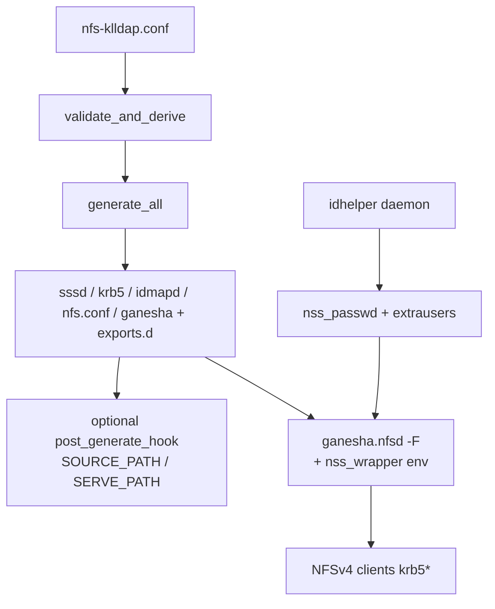

# Ganesha Architecture & Bind-Mount Contract

**Purpose:** serve-path contract, ACL vs NOACL generation, identity/runtime hardening for the packaged Ganesha binary.

Ganesha **9.13-1+klldap3** (custom build; one ACL-capable binary, NOACL per-export via `Disable_ACL`; klldap2 normalizes nsswitch `getgrouplist` return so supplemental groups are not dropped; klldap3 single-flights uid2grp cache-miss fetches so concurrent NSS rewrites cannot cache a partial group list — see [container/ganesha/README.md](../container/ganesha/README.md)).

Single TOML (`nfs-klldap.conf`) is source of truth. `nfs-klldap-config` validates, derives, and generates sssd/krb5/idmapd/nfs/ganesha fragments. `nfs-klldap-startup supervise` is pid 1: preflight, ordered start, SIGHUP graceful apply + SIGUSR1 full recycle. WebUI (HTTPS 9630) edits TOML and applies chown/chmod on allowed `host_path` trees. Ganesha VFS + SSSD serve NFSv4 krb5*. No host kernel NFS (unless `HOST_NFS` sidecar mode).

## Key contracts

| Contract | Rule |
|----------|------|
| `host_path` vs container | UI allow-list + ownership use the **host** absolute path. Each share requires `container_path`: absolute in-container serve dir = Ganesha EXPORT `Path=`, fs probes, WebUI permission tree / meta / ACLs / chown+chmod (`serve_path_for` → `container_path`). `pseudo_path` (default `/<name>`) is **only** the client Pseudo. Example: bind `/var/data:/export`, `host_path=/var/data/nvme-raid/users` → `container_path=/export/nvme-raid/users`. Translation only at the syscall boundary (`FsManager`). |
| Hostname | `get_consistent_hostname()` requires `hostname(1)` == `/proc/sys/kernel/hostname`. Prefer `--uts=host`. |
| Realm | Required. Auto-derived from `ldap_uri` host or `NFS_KLLDAP_KERBEROS_REALM`. No silent EXAMPLE.COM. |
| ldap_uri | DNS hostname only (IP rejected). Forward+reverse for Kerberos NFS. Keytab: `nfs/<short>@REALM` and `nfs/<fqdn>@REALM` when they differ. |
| Execution | Ganesha, SSSD, WebUI, generator run as root in the container. |
| Reload | Two triggers. **SIGHUP** (watcher, WebUI shares save) → generate + `plan_from_changes`: Ganesha SIGHUP `reread_exports` (stop/start only if dead), WebUI **in-process reload** (no restart — sessions/connections survive), identity changes **staged on disk** without daemon restarts. **SIGUSR1** ("Restart and apply", setup completion) → generate + `plan_full_recycle`: restart SSSD/idhelper/WebUI + Ganesha stop/start (clients reclaim via grace) regardless of fingerprints — the only path applying staged identity and ganesha-main-conf/nfs.conf/WebUI-settings edits. No full container death. System bus is for Ganesha internals; management is fragments + signals. |

## Volumes (typical)

```yaml
volumes:
  - /media/:/export:rw                # parent bind; set each share's container_path under container_root
  - ./config:/config:rw               # nfs-klldap.conf
  - ./secrets/krb5.keytab:/etc/krb5.keytab:ro
  - ./ganesha-recovery:/var/lib/nfs/ganesha:rw  # NFSv4 recovery; without it clients cannot reclaim across recreate
```

## Runtime flow (generate → serve)



## Identity & runtime hardening

Generated `ganesha.conf` sets load-bearing identity/runtime parameters explicitly (names ground-truthed on 9.6 and re-checked on 9.13). Overrides live under `[ganesha]`:

| Directive (default) | `[ganesha]` override | Why |
|---------------------|----------------------|-----|
| `Root_Kerberos_Principal = nfs, root;` | `root_kerberos_principals` (`none`/`nfs`/`root`/`host`/`all`; `none` overrides rest) | Upstream default `all` makes any `host/` keytab root on every export. Excluding `host` maps machine creds via normal idmap → anonymous. Pair with `root_squash`. |
| `Squash = root_squash;` (per-share default) | share `squash` / UI checkbox → `no_root_squash` | Default since 0.9.81. WebUI does privileged ops container-side, not over NFS. |
| *(getgroups window = Idmapped_*)* | `manage_gids_expiration_secs` / share key / `idmapped_validity_secs` | 9.13 routes old core `Manage_Gids_Expiration` through DIRECTORY_SERVICES Idmapped_*; core param no longer emitted. Smallest share value seeds; `idmapped_validity_secs` wins. |
| `Max_Uid_To_Group_Reqs = 64;` | `max_uid_to_group_reqs` | Cap concurrent uid→groups storms. |
| `Negative_Cache_Time_Validity = 60;` | `negative_cache_validity_secs` | Faster positive visibility for new LDAP entities (upstream 300s). |
| `Idmapped_*_Time_Validity = 180;` | `idmapped_validity_secs` | Identity + getgroups trust window (~3 min natural group propagation with matching SSSD/rebulk defaults). |
| `Getattrs_In_Complete_Read = false;` | `getattrs_in_complete_read` | ESXi EOF workaround off for Fedora-immutable fleet. |
| `Enable_malloc_trim` + 1024 MB threshold | `malloc_trim`, `malloc_trim_min_threshold_mb` | Trim under 4 GB container limit (upstream threshold never fires). |
| `Readdir_Res_Size = 32768;` | `readdir_res_size`, `readdir_max_count` | Declared readdir sizing. |
| `Attr_Expiration_Time = 60;` | `attr_expiration_secs` (+ per-share) | Out-of-band UI edit visibility; `0` = always fresh. No DBus attr purge on 9.13. |
| `RecoveryRoot = /var/lib/nfs/ganesha;` | — | Volume-backed. |
| `Lease_Lifetime = 60;` + `Grace_Period = 90;` | — | Grace ≥ lease (upstream pairing). |

### Group-change propagation

Three caches: (1) SSSD `entry_cache_timeout`, (2) idhelper LDAP + nss materialization, (3) Ganesha uid2grp (`Idmapped_Group_Time_Validity`). Flushing only `sss_cache -E` is insufficient.

- **Natural:** defaults `entry_cache_timeout = 180`, rebulk `NFS_KLLDAP_IDHELPER_REBULK_INTERVAL_SECS = 180`, Idmapped = 180 → typically ~3 min (worst under ~10). New entities: negative caches ≈ ≤2 min.
- **Instant:** `ganesha-ctl refresh-identity [user]` — sss_cache + idhelper REBULK (full resolver clear) + DBus `purge_gids`.

### Change-visibility (out-of-band UI edits)

| Change | Visible within |
|--------|----------------|
| UI chown/chmod/ACL | server `Attr_Expiration_Time` (default 60s) + client attr cache |
| New/removed names | readdir/dirent + client `lookupcache=all` |
| LDAP identity | three-layer group contract above |

Live export gate: `scripts/ganesha-export-reload-smoke.sh` (add/update/remove via SIGHUP; pid unchanged).

## ACL and filesystem compatibility

**ACL is auto per share since 0.9.90** (explicit always wins). Two mainline fragment paths:

- **NOACL** — `enable_acl = false`, or unset when the probe cannot **prove** ACL support. Emits `Pseudo = /<name>;` (from `pseudo_path` or name), `Disable_ACL = true; Manage_Gids = true; Read_Access_Check_Policy = pre;`. `read_access_policy = post` on NOACL normalizes to `pre` (warning).
- **ACL** — `enable_acl = true`, or **auto** when unset and the serve path passes the setfacl/getfacl **write round-trip**. Emits `Disable_ACL = false;` (declared). Auto-promoted fragments get an `# Auto-enabled` comment. No per-export Umask (gone in 9.13).

**Store:** on-disk POSIX ACLs (`system.posix_acl_access` / `_default`) only — no private blob store.

**Fail-closed auto:** promotion requires write-probe proof; unproven → NOACL. `enable_acl = true` + definitive-negative probe → **hard generate error**. Inconclusive → loud warning.

**9.13 VFS note:** `vfs_sub_getattrs` may fetch POSIX ACLs on attribute refresh even when `Disable_ACL` is set. Filesystems that cannot store POSIX ACLs (vfat/ntfs/exfat, `noacl` mounts) are expected to fail attribute fetches for **both** share classes — stage onto an ACL-capable tree. `Disable_ACL` is advisory (does not strip ATTR_ACL from supported attrs); NOACL class = declared policy + trees without extended ACLs.

**Client contract:** NFSv4.2 mounts are class-agnostic (`noacl` mount option is NFSv3 sideband, inert here). Clients cannot detect class over the wire. Host publishes class via unauthenticated **`GET /client-manifest.json`** (name, pseudo, security, rw, `acl`/`noacl` + label; no internal paths; `Cache-Control: no-store`). Class is per **share** (serve root); incapable submounts → Settings warning + `/acl-apply` 422, not per-dir class.

**Staging:** `source_path` = data bind; `container_path` = ACL-capable serve tree; `host_path` for WebUI. Optional `[ganesha] post_generate_hook` (see `examples/post-generate-staging-sync.sh`) syncs source → serve after generate.

| Filesystem / setting | Behavior |
|----------------------|----------|
| any, `enable_acl = false` | NOACL path |
| ACL-capable FS, `enable_acl` unset | auto → ACL after proven probe; else NOACL |
| ext4/xfs/btrfs+acl, `enable_acl = true` | ACL path |
| vfat/ntfs, btrfs+noacl | not servable without staging; `enable_acl = true` hard-fails generate |

`manage_gids` defaults true on both paths. Preflight identity: `ganesha_identity_pipeline` + runtime nss/socket GRPS + `ganesha-ctl id-resolve`.

## NFS create inheritance

New files/dirs: `(mode & ~umask)` + parent default ACLs. **Ganesha 9.13 has no per-export FSAL Umask** — generator never emits it.

- `[[shares]] umask` is **retired** (hard generate error; structured saves drop the key). Use share group + setgid + Inherit-tab default ACLs.
- NOACL: host umask + FS semantics only.
- Named access ACLs do not inherit unless default entries exist (Inherit tab → `setfacl -d`).

See [nfs-klldap-ui/docs/ui-design.md](../nfs-klldap-ui/docs/ui-design.md) for panel apply behavior.
