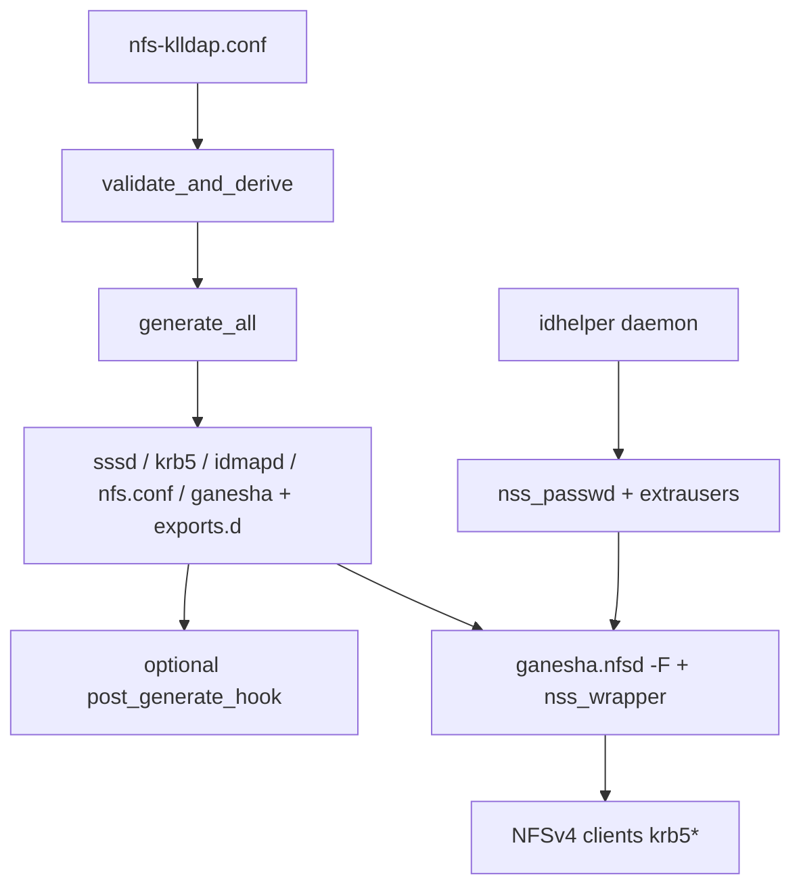

# Ganesha Architecture & Bind-Mount Contract

**Purpose:** serve-path contract, ACL vs NOACL generation, identity/runtime hardening.

Ganesha **9.13-1+klldap3** — one ACL-capable binary; NOACL per-export via `Disable_ACL`. klldap2 fixes nsswitch `getgrouplist` return; klldap3 single-flights uid2grp cache-miss fetches. Packaging: [container/ganesha/README.md](../container/ganesha/README.md).

Single TOML (`nfs-klldap.conf`) is source of truth. `nfs-klldap-config` validates and generates sssd/krb5/idmapd/nfs/ganesha. `nfs-klldap-startup supervise` is pid 1 (SIGHUP graceful apply, SIGUSR1 full recycle). WebUI HTTPS :9630 edits TOML and chowns/chmods allowed `host_path` trees.

## Key contracts

| Contract | Rule |
|----------|------|
| Serve path | `host_path` = host absolute (UI allow-list + ownership). **`container_path` required** = in-container serve dir (Ganesha `Path=`, probes, permission tree). `pseudo_path` (default `/<name>`) = client Pseudo only. Example: bind `/var/data:/export`, `host_path=/var/data/users` → `container_path=/export/users`. |
| Hostname | `hostname(1)` == `/proc/sys/kernel/hostname`. Prefer `--uts=host`. |
| Realm / ldap_uri | Realm required (from `ldap_uri` host or env). DNS hostname only (no raw IP). Keytab: `nfs/<short>@REALM` and `nfs/<fqdn>@REALM` when they differ. |
| Reload | **SIGHUP** → generate + `plan_from_changes`: Ganesha export reread, WebUI in-process reload, identity **staged**. **SIGUSR1** → `plan_full_recycle`: restart SSSD/idhelper/WebUI + Ganesha stop/start; only path that applies staged identity and main-conf/nfs.conf/WebUI settings. |

## Volumes (typical)

```yaml
volumes:
  - /media/:/export:rw
  - ./config:/config:rw
  - ./secrets/krb5.keytab:/etc/krb5.keytab:ro
  - ./ganesha-recovery:/var/lib/nfs/ganesha:rw  # NFSv4 recovery across recreate
```

## Runtime flow



## Identity & runtime hardening

Generated `ganesha.conf` sets load-bearing parameters (override under `[ganesha]`):

| Directive (default) | Override | Why |
|---------------------|----------|-----|
| `Root_Kerberos_Principal = nfs, root;` | `root_kerberos_principals` | Exclude `host` so machine keytabs are not root on every export |
| `Squash = root_squash;` | share `squash` | Default; WebUI does privileged ops container-side |
| Idmapped_* (180s) | `idmapped_validity_secs` / share `manage_gids_expiration` | 9.13 getgroups window (core `Manage_Gids_Expiration` not emitted) |
| `Max_Uid_To_Group_Reqs = 64;` | `max_uid_to_group_reqs` | Cap concurrent uid→groups storms |
| `Negative_Cache_Time_Validity = 60;` | `negative_cache_validity_secs` | Faster positive visibility for new entities |
| `Getattrs_In_Complete_Read = false;` | `getattrs_in_complete_read` | ESXi EOF workaround off for Fedora-immutable fleet |
| malloc_trim + 1024 MB | `malloc_trim*` | Trim under small container limits |
| `Attr_Expiration_Time = 60;` | `attr_expiration_secs` | Out-of-band UI edit visibility (`0` = always fresh) |
| RecoveryRoot / Lease 60 / Grace 90 | — | Volume-backed recovery; grace ≥ lease |

### Group-change propagation

Three caches: SSSD `entry_cache_timeout`, idhelper materialization, Ganesha uid2grp. Flushing only `sss_cache -E` is insufficient.

- **Natural:** defaults 180s each layer → ~3 min typical.
- **Instant:** `ganesha-ctl refresh-identity [user]` — sss_cache + idhelper REBULK + DBus `purge_gids`. Nonzero exit = a layer did not confirm.

UI chown/chmod/ACL visible within server `Attr_Expiration_Time` + client attr cache. Live export gate: `scripts/ganesha-export-reload-smoke.sh`.

## ACL and filesystem compatibility

**ACL is auto per share** (explicit always wins):

| Path | When | Emission |
|------|------|----------|
| **NOACL** | `enable_acl = false`, or auto when probe cannot **prove** ACL | `Disable_ACL = true; Manage_Gids = true; Read_Access_Check_Policy = pre;` + Pseudo |
| **ACL** | `enable_acl = true`, or auto when write round-trip probe proves storage | `Disable_ACL = false;` (declared). No per-export Umask on 9.13 |

- Store: on-disk POSIX ACLs only (`system.posix_acl_*`).
- `enable_acl = true` + definitive non-ACL FS → **hard generate error**. Inconclusive → warning, stay NOACL for auto.
- Limited FS (vfat/ntfs/`noacl`): stage via `source_path` → ACL-capable `container_path` + optional `[ganesha] post_generate_hook` (`examples/post-generate-staging-sync.sh`).
- Class is per **share**; clients use `GET /client-manifest.json` (no session). Wire ACLs use numeric owners (`Only_Numeric_Owners`).
- Backups: preserve **numeric** ownership (`rsync -aAX --numeric-ids`, `tar --acls --numeric-owner`).

## NFS create inheritance

New files/dirs: `(mode & ~umask)` + parent default ACLs. **No per-export FSAL Umask** on 9.13.

- `[[shares]] umask` is **retired** (hard generate error). Use share group + setgid + Inherit-tab default ACLs.
- Named access ACLs do not inherit without default entries (Inherit tab → `setfacl -d`).

See [nfs-klldap-ui/docs/ui-design.md](../nfs-klldap-ui/docs/ui-design.md).
