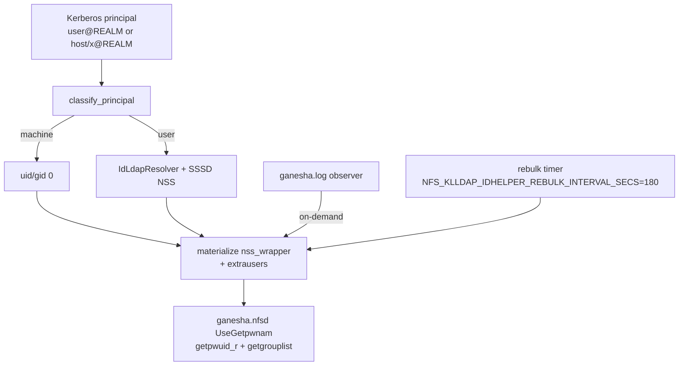

# LLDAP POSIX + SSSD for Ganesha NFSv4 ID Mapping

**Purpose:** LDAP/SSSD generation, TLS, and idhelper identity mapping.

SSSD (LDAP provider) supplies `uidNumber`/`gidNumber` from LLDAP/KLLDAP to Ganesha. The WebUI applies chown/chmod on bind-mounted host paths.

Shared resolution (`IdLdapResolver`, POSIX mapping, principal classification) lives in **`nfs-klldap-identity`**. Config, idhelper, and WebUI `LdapClient` all use it.

**KLLDAP load contract (0.9.81+):** one pooled bound connection (bind on first use, DN change, or op failure — not per search). Positive cache 10 min; negative/errors 60 s. memberOf DNs resolve from the group cache first. Each idhelper rebulk logs `ldap_binds=+N`.

## LLDAP requirements

| Entity | ObjectClass | Required attributes |
|--------|-------------|---------------------|
| Users (`ou=people`) | `posixAccount` | `uid`, `uidNumber`, `gidNumber`, `homeDirectory`, `loginShell` |
| Groups (`ou=groups`) | `posixGroup` | `cn`, `gidNumber` |

Numeric IDs in LDAP must match ownership on host data directories.

## nfs-klldap.conf → generated sssd.conf

| TOML field | Default when omitted | In generated sssd.conf |
|------------|----------------------|-------------------------|
| `ldap_default_bind_dn` / `authtok` | required | yes |
| `kllldap_ignored_attributes` | `true` | ignore block + `ldap_group_member=member` |
| `ldap_schema` | `rfc2307bis` | yes |
| `ldap_id_mapping` | `false` | yes |
| `enumerate` | `false` | yes (avoid `true` on KLLDAP) |
| `auth_provider` | `ldap` | yes (`krb5` optional) |
| `access_provider` | `permit` | yes |
| `entry_cache_timeout` | `180` | yes |
| `entry_negative_timeout` | `60` | yes |
| Search bases | `dc=<realm>` Subtree | derived or explicit |
| Kerberos KDC (`krb5_*`) | from ldap_uri host + realm | always emitted |
| `ldap_tls_reqcert` | unset for ldaps | only if set in TOML |
| `ldap_auth_disable_tls_never_use_in_production` | `true` for `ldap://` only | conditional |

### TLS

- **`ldaps://` without `ldap_tls_reqcert`:** SSSD system/OpenLDAP defaults (not auto-`never`). Self-signed lab: `ldap_tls_reqcert = "never"`.
- **`ldap://`:** generator emits `ldap_auth_disable_tls_never_use_in_production = true` by default (lab only).
- **WebUI LDAP client:** `ldap_tls_policy()` — unset ldaps is permissive for probes unless `ldap_tls_reqcert` is set.

### Example `[sssd]`

```toml
ldap_uri = "ldaps://klldap.example.com:6360"

[sssd]
ldap_default_bind_dn = "uid=admin,ou=people,dc=example,dc=com"
ldap_default_authtok = "..."
ldap_tls_reqcert = "never"   # typical self-signed LLDAP/KLLDAP
```

Copy generated `ignored_*_attributes` into the KLLDAP server config when using ignored attributes.

## Identity path (idhelper + Ganesha)



### Machine vs user principals

| Principal form | Mapping |
|----------------|---------|
| `host/…@REALM`, `nfs/…`, `root/…` | machine → uid/gid 0 + full supp materialization |
| `alice@REALM` | user via LDAP POSIX + nss materialization |

Ganesha does not inject dynamic data into `ganesha.conf` for live mapping: we emit static `Root_Kerberos_Principal = nfs, root` (excludes `host` so client machine keytabs are not root on exports; override via `[ganesha] root_kerberos_principals`). Live uid/gid translation is nss_wrapper + idhelper.

Also generated: `/etc/idmapd.conf` (Domain + Local-Realms from realm; Method + GSS-Methods = nsswitch) and DIRECTORY_SERVICES (`Pwnam_Implementation=nsswitch`, `UseGetpwnam=true`, Only/Allow_Numeric).

Client display of owners: server emits `Only_Numeric_Owners`; Ganesha encodes wire ids with +524287 offset — install `scripts/nfsidmap-client-helper` on clients ([client-fedora-immutable.md](client-fedora-immutable.md)).

### Commands (in container)

```bash
/container/healthcheck.sh
getent passwd alice && id alice
nfs-klldap-idhelper resolve 'host/myclient.example.com@MY.REALM'
ganesha-ctl id-resolve 'alice@MY.REALM'
ganesha-ctl id-map-test testuser1
ganesha-ctl refresh-identity    # flush SSSD + idhelper + Ganesha gids
cat /var/lib/nfs-klldap/nss_passwd
klist -k /etc/krb5.keytab
```

Periodic rebulk: `NFS_KLLDAP_IDHELPER_REBULK_INTERVAL_SECS` (default **180**, `0` disables). Observer handles new principals from `ganesha.log`.

## Common issues

| Symptom | Likely cause |
|---------|----------------|
| `nobody` / 65534 | missing POSIX objectClasses/attrs, or host UID mismatch |
| Permission denied with correct IDs | ownership ≠ LDAP IDs, or SELinux on binds |
| LDAP/TLS noise | enable KLLDAP ignores; avoid `enumerate=true` |
| Large numeric owners on client | missing id_resolver helper (see client guide) |
| Hybrid Kerberos teardown | incomplete machine materialization — `ganesha-ctl id-check` |

See also [README.md](../README.md) (Identity section) and [TESTING.md](../TESTING.md).
