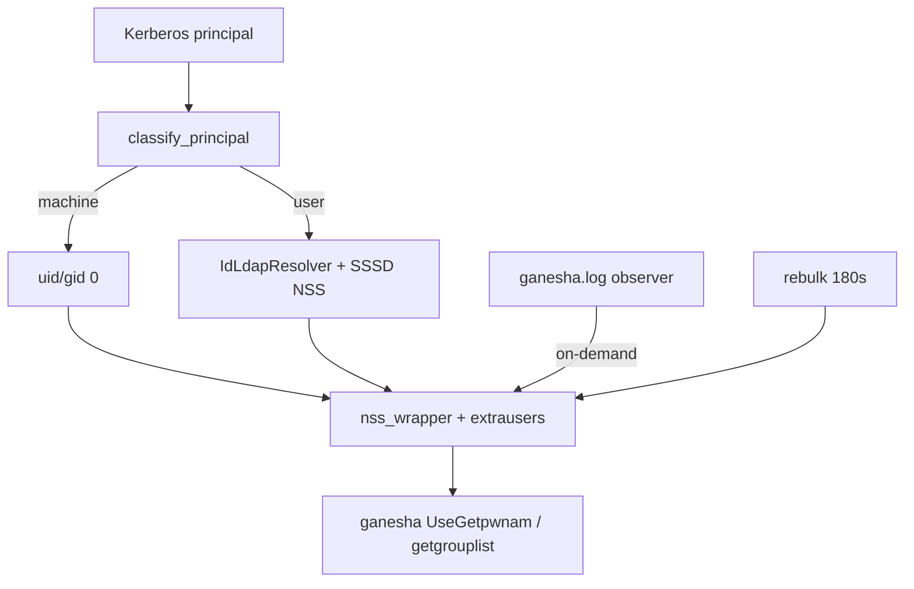

# LLDAP POSIX + SSSD for Ganesha NFSv4 ID Mapping

**Purpose:** LDAP/SSSD generation, TLS, and idhelper identity mapping.

SSSD (LDAP provider) supplies `uidNumber`/`gidNumber` from LLDAP/KLLDAP to Ganesha. Shared resolution lives in **`nfs-klldap-identity`** (used by config, idhelper, WebUI).

**KLLDAP load:** one pooled bound connection; positive cache 10 min; negative/errors 60 s. Rebulk logs `ldap_binds=+N`.

## LLDAP requirements

| Entity | ObjectClass | Required attributes |
|--------|-------------|---------------------|
| Users (`ou=people`) | `posixAccount` | `uid`, `uidNumber`, `gidNumber`, `homeDirectory`, `loginShell` |
| Groups (`ou=groups`) | `posixGroup` | `cn`, `gidNumber` |

Numeric IDs in LDAP must match ownership on host data.

## nfs-klldap.conf → sssd.conf

| TOML field | Default | Generated |
|------------|---------|-----------|
| bind DN / authtok | required | yes |
| `kllldap_ignored_attributes` | `true` | ignore block + `ldap_group_member=member` |
| `ldap_schema` | `rfc2307bis` | yes |
| `ldap_id_mapping` | `false` | yes |
| `enumerate` | `false` | yes (avoid `true` on KLLDAP) |
| `auth_provider` | `ldap` | yes |
| `access_provider` | `permit` | yes |
| `entry_cache_timeout` | `180` | yes |
| `entry_negative_timeout` | `60` | yes |
| Search bases | `dc=<realm>` Subtree | derived or explicit |
| Kerberos KDC | from ldap_uri + realm | always |
| `ldap_tls_reqcert` | unset for ldaps | only if set |
| `ldap_auth_disable_tls_never_use_in_production` | `true` for `ldap://` | conditional |

### TLS

- **`ldaps://` without `ldap_tls_reqcert`:** system/OpenLDAP defaults (not auto-`never`). Lab: `ldap_tls_reqcert = "never"`.
- **`ldap://`:** generator emits the disable-TLS production flag by default (lab only).
- **WebUI LDAP client:** no-verify for `ldaps://` without CA (startup WARNING). Set `ldap_tls_cacert` to verify. `ldap_tls_reqcert = "never"` forces no-verify.

```toml
ldap_uri = "ldaps://klldap.example.com:6360"

[sssd]
ldap_default_bind_dn = "uid=admin,ou=people,dc=example,dc=com"
ldap_default_authtok = "..."
ldap_tls_reqcert = "never"
```

## Identity path



| Principal | Mapping |
|-----------|---------|
| `host/…`, `nfs/…`, `root/…` @REALM | machine → 0 + full supp materialization |
| `alice@REALM` | user via LDAP POSIX + nss |

Static Ganesha: `Root_Kerberos_Principal = nfs, root` (excludes `host`). Live mapping is nss_wrapper + idhelper. Also: `/etc/idmapd.conf` + DIRECTORY_SERVICES (`UseGetpwnam`, Only/Allow_Numeric).

Client display of owners needs `scripts/nfsidmap-client-helper` ([client-fedora-immutable.md](client-fedora-immutable.md)) — wire uses +524287 offset with `Only_Numeric_Owners`.

```bash
getent passwd alice && id alice
nfs-klldap-idhelper resolve 'host/myclient.example.com@MY.REALM'
ganesha-ctl id-resolve 'alice@MY.REALM'
ganesha-ctl refresh-identity
```

Rebulk: `NFS_KLLDAP_IDHELPER_REBULK_INTERVAL_SECS` (default **180**, `0` = off).

## Common issues

| Symptom | Likely cause |
|---------|----------------|
| `nobody` / 65534 | missing POSIX attrs, or host UID mismatch |
| Permission denied with correct IDs | ownership ≠ LDAP IDs, or SELinux |
| LDAP/TLS noise | enable KLLDAP ignores; avoid `enumerate=true` |
| Large numeric owners on client | missing id_resolver helper |
| Hybrid Kerberos teardown | incomplete machine materialization — `ganesha-ctl id-check` |
