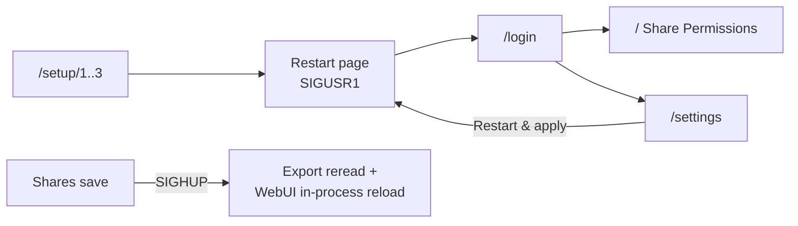

# UI Notes

**Purpose:** WebUI surfaces, apply contracts, routes, and theme shell.

Axum + HTMX + server templates (`base.html`). Setup: `/setup/1` → `/setup/2`–`/3` (**Test Settings** then **Save and Continue**) → restarting page (SIGUSR1 full recycle, polls `/restart-status`) → `/login` + `POST /setup-password`. Pre-configured conf + keytab skips setup.

Auth: `webui-password` sidecar (localhost) or LLDAP `webui_admin_group`. Session TTL defaults to 12h (`[webui] session_timeout_minutes`; cookie Max-Age + server expiry; new value after full restart).

## Share Permissions (`/`)

Detached panel (`#perm-panel`) beside a lazy tree. Tree lists **dirs then files** (one level per `/tree` fetch); symlinks excluded; empty dir shows `(empty)`.

| Node | Editor |
|------|--------|
| Directory | Condensed Read/Write matrix (server fuses r→x), setgid/sticky, apply scopes (none / single / all), Exec = file-execute grant for recursive scopes |
| File | Full rwx triad; no specials; no recursive scope |

One **Apply** commits POSIX + staged ACL ops (`POST /apply`, optional `acl_ops` JSON). Unresolvable principals, incapable mounts, or a bad batch reject the whole apply before any mutation.

### ACL section

Shown when the share **effectively serves ACLs** (resolved `enable_acl` — explicit `true` or **auto** after a capable write probe — **and** capable FS). Otherwise Non-ACL with a short reason.

| Config | Probe | Chip / dot |
|--------|-------|------------|
| `enable_acl = false` | any | off (blue) |
| `enable_acl = true` | Capable | on (green) |
| `enable_acl = true` | Inconclusive / Incapable | on (unverified) / on (unsupported) |
| unset (auto) | Capable | **auto (on)** (green) |
| unset (auto) | else | **auto (off)** (blue) |

Dropdown label: **auto (detect)**. Same matrix drives Settings cards and `GET /client-manifest.json`.

Tabs: **Current** (access ACL) and **Inherit** (default ACL, directories only). Editing is staged in the panel; Apply diffs the DOM and submits the batch. `/acl-apply` remains for single-op API use. Recursive ACL: dirs get fused r→x; files get the literal triad. Extended ACL rows show a `+` marker on the tree.

### Ownership & modes

- uid/gid **0** is first-class (“nobody (0)”); typed `nobody`/`root` → 0.
- Directory Read implies execute server-side (`dir_mode_r_implies_x`); x-less submit is fine.
- Scope **None** = selected inode only; **single** = that dir + direct files; **all** = subtree. Recursive scopes need confirm().

Client: `/assets/permissions.js` → `window.PermUI`. Apply Log polls `/apply-progress` (HTTP **286** stops htmx 1.9 polling).

Share-card chips signal **non-conformity only** (RO, no_root_squash, non-default cache/security, navahi when effective). Blank security stays unset and inherits `[ganesha] default_security`.

## System Settings

### Shares

- Cards from `templates/share_card.html`; blank card: `GET /settings/share-card?idx=N`.
- Status dots/chips use `share_acl_status` (table above).
- **Navahi:** Core `navahi_discovery` (staged until Restart & apply). Per-share `navahi_insecure` muted (not hidden) while global is off. Chip only when **global && flag**.

### Admin

| Block | Action |
|-------|--------|
| Restart & apply | `POST /settings/restart` (SIGUSR1); HOST_NFS → “Apply to host” |
| Local password | `POST /settings/change-password` (localhost needs current pw; LDAP admin live group re-check, fail-closed) |
| Sessions | `session_timeout_minutes` via `form=` into main settings form |
| Maintenance | Re-probe filesystems; Refresh identity |
| System | Version, bind, deploy mode |

Pane id `admin` (legacy `localStorage` value `apply` is remapped).

## Shell, theme, assets

- Shell: centered, `--page-max: 1280px`. Narrow forms: `.content-narrow`.
- `restarting.html` is standalone (no `base.html`); keep palette in sync manually.
- Theme: FOUC early-init + isolated theme manager in `base.html` head, then deferred `permissions.js`. Never call `document.body` at top-level in head scripts.
- htmx **1.9.12** vendored (versioned filename, immutable cache). `permissions.js` unversioned, `Cache-Control: no-cache`.

## Routes

| Method | Path | Purpose | Auth |
|--------|------|---------|------|
| GET | `/assets/*` | htmx + permissions.js | none (setup-gate exempt) |
| GET/POST | `/login`, `/logout`, `/setup-password` | auth | none |
| GET | `/restart-status` | post-recycle poller | none |
| GET/POST | `/setup`, `/setup/1..3`, step test/continue | wizard | none (pre-setup) |
| GET | `/`, `/tree`, `/dir-perms` | tree + panel | session |
| GET | `/users/search`, `/groups/search` | LDAP suggestions | session |
| POST | `/apply`, `/acl-apply`, `/cancel-apply` | mutate | session |
| GET | `/apply-progress` | Apply Log (286 = done) | session |
| GET | `/settings`, `/settings/share-card` | settings UI | session |
| POST | `/settings/save`, `save-shares`, `save-raw` | conf writes | session |
| POST | `/settings/restart` | full recycle | session |
| POST | `/settings/change-password`, maintenance, probes | admin | session |
| GET | `/client-manifest.json` | public share class list | none |

While setup is incomplete, non-allowlisted routes redirect to the wizard. Session checks use `require_auth` per handler.
